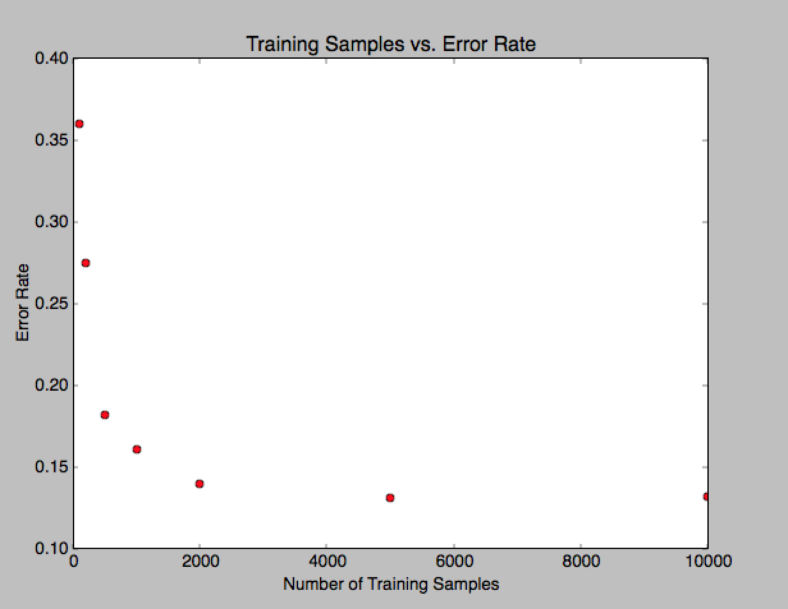
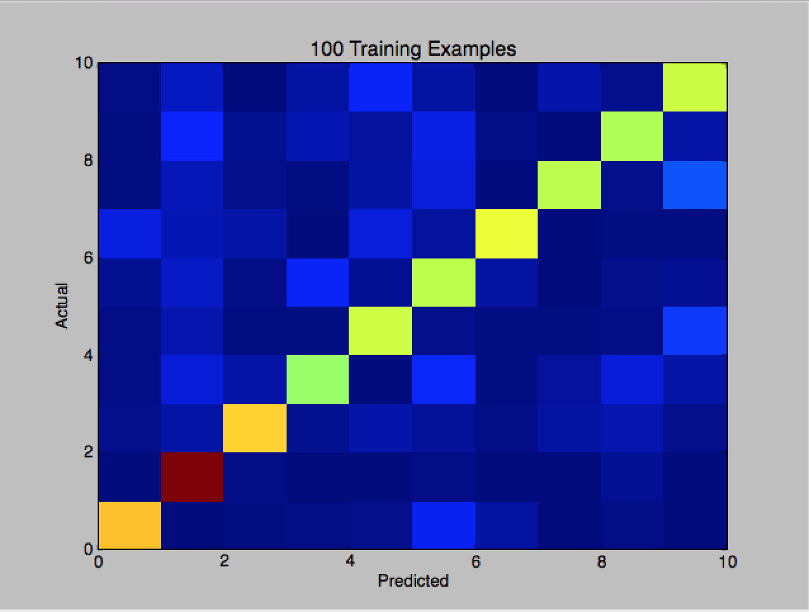
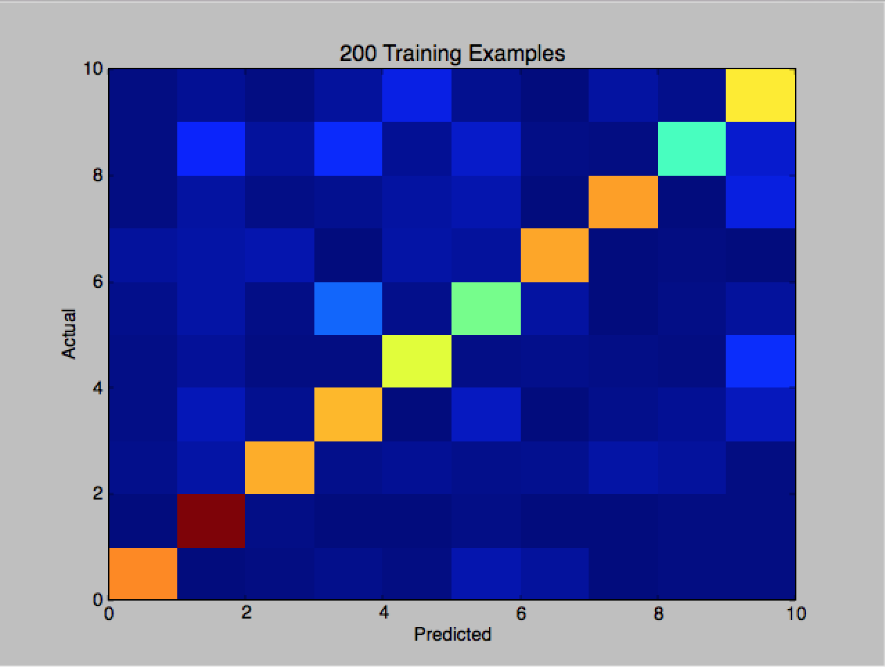
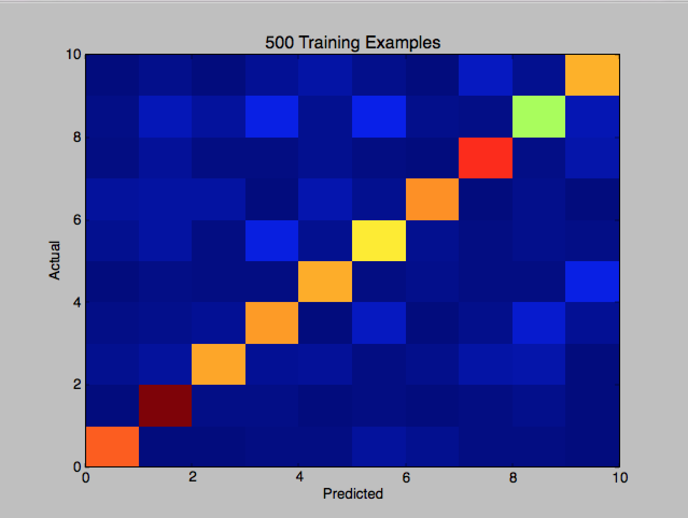
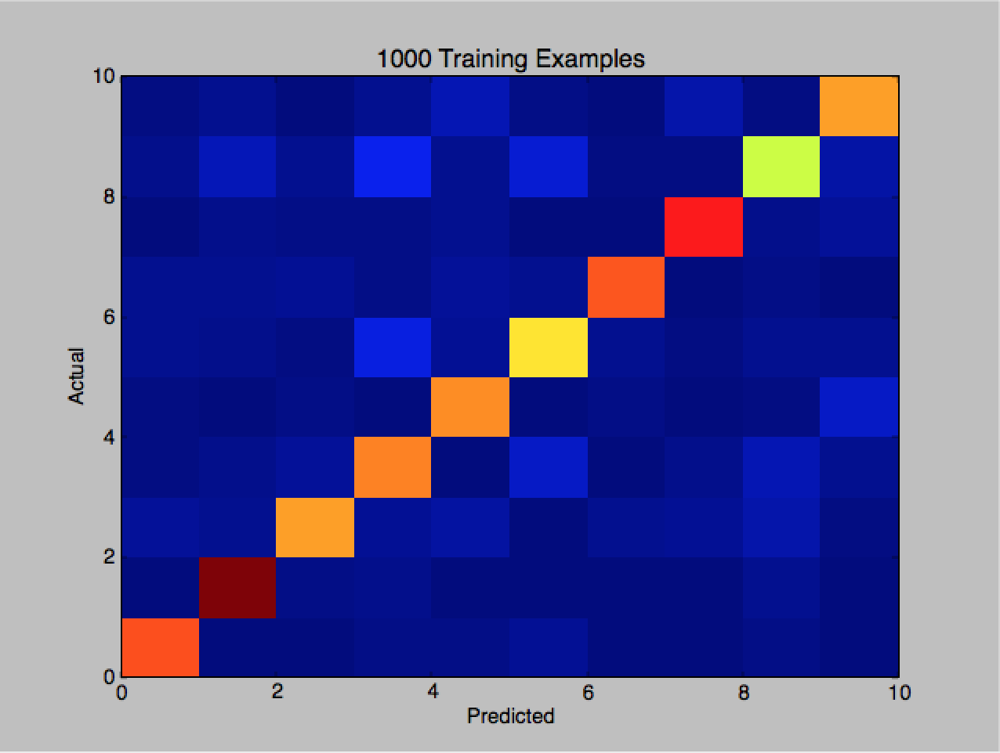
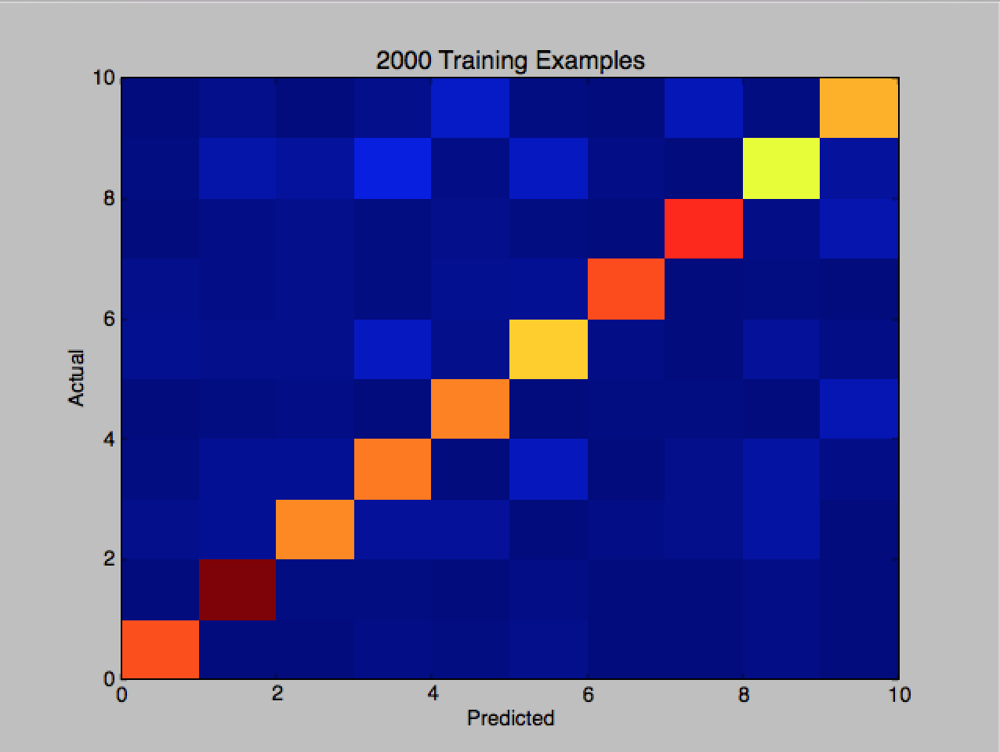
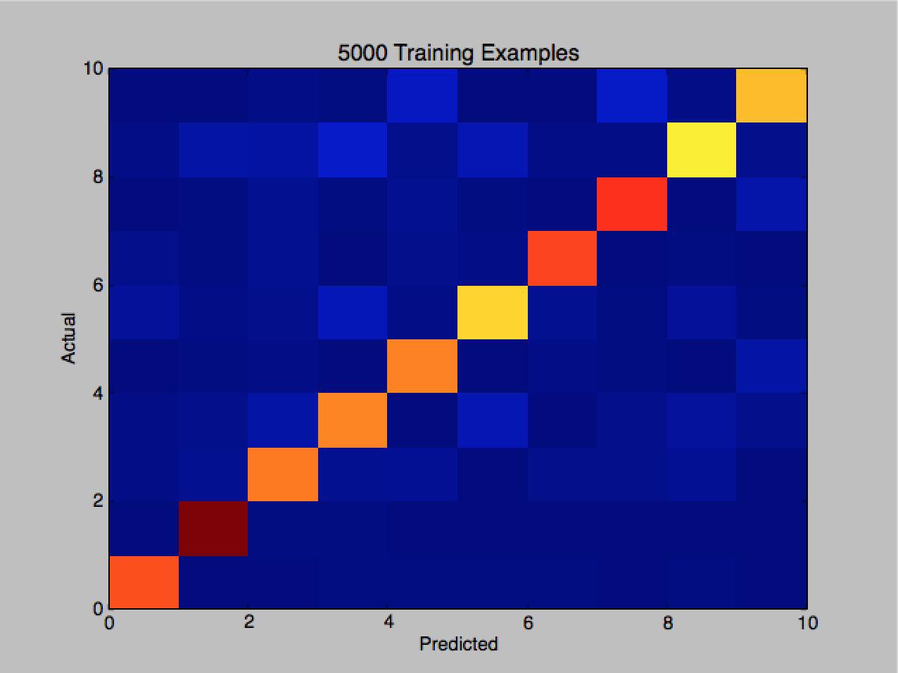
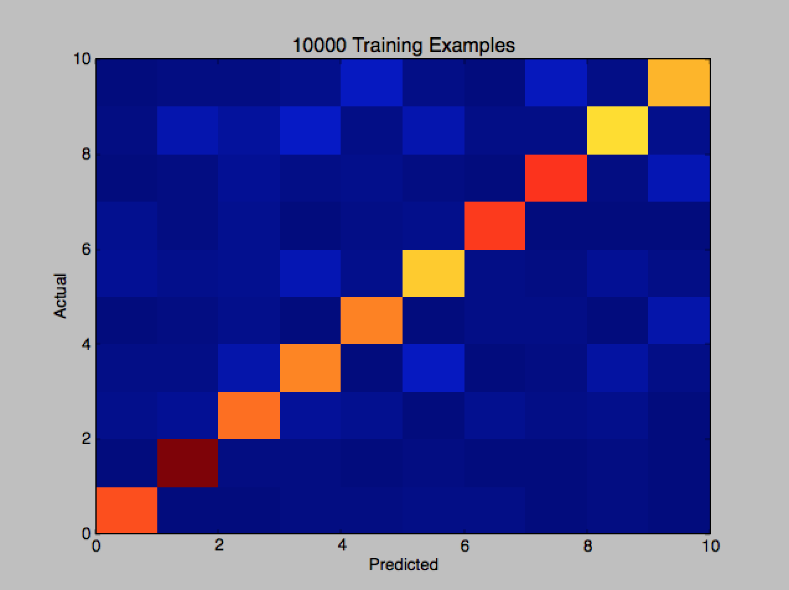

# SVM 


Digit recognition on variant of MNIST dataset and classifying spam messages with SVM. 

name: Andy Chu 

Program versions:
Python version 2.6.
matplotlib==1.1.1
numpy==1.6.2
scikit-learn==0.17
scipy==0.11.0


How to run programs:

    1. and 2. python2.6 svm.py
       (#2 shows up before #1)

    3. to find c with smallest cross validation error: python2.6 cross.py 
       to find validation error with particular c: python2.6 valid3.py 
       to write the .csv file to send to kaggle: python2.6 prob3c.py

    4. to find c with smallest cross validation error: python2.6 cross4.py
       to find validation error with particular c: python2.6 valid4.py
       to write the .csv file to send to kaggle: python2.6 prob4c.py 


```python
from IPython.core.display import Image
Image(filename=('/Users/and1can/Desktop/hw1/hw1submission/svmplot.png'))
```





We see that as the number of training examples increases, the error rate decreases. We can see this is evident through the confusion matrices because for matrices that have more training examples, the diagonal has more reddish colors. The reddish colors mean that there are more number of correctly predicted numbers and that our learning algoirthm makes less incorrect predictions. Thus, we can conclude that our algorithm does better with more training examples.


```python
from IPython.core.display import Image
Image(filename=('/Users/and1can/Desktop/hw1/hw1submission/100.png'))

```





```python
from IPython.core.display import Image
Image(filename=('/Users/and1can/Desktop/hw1/hw1submission/200.png'))
```





```python
from IPython.core.display import Image
Image(filename=('/Users/and1can/Desktop/hw1/hw1submission/500.png'))
```





```python
from IPython.core.display import Image
Image(filename=('/Users/and1can/Desktop/hw1/hw1submission/1000.png'))
```





```python
from IPython.core.display import Image
Image(filename=('/Users/and1can/Desktop/hw1/hw1submission/2000.png'))
```





```python
from IPython.core.display import Image
Image(filename=('/Users/and1can/Desktop/hw1/hw1submission/5000.png'))
```





```python
from IPython.core.display import Image
Image(filename=('/Users/and1can/Desktop/hw1/hw1submission/10000.png'))
```





Cross validation helps because we do not know if we have validation set that is skewed. Having validation set that is skewed can deceptively make us think that our algorithm is doing well or extremely not well, even though the data set is an outlier and on average our algorithm will perform differently than it will on a single set of validation. Doing k-cross validation will allow us to get a better sense of how our algorithm is doing because we choose different sets of samples to be our validaiton and average the results. c value 1.75751062485e − 06 with cross validation error of 0.08958. validation error rate is 0.1035. kaggle score is 0.87740.


```python

```

The c value in SVM is 1e − 06 with cross validation error of 0.288. validation error rate is 0.209. kaggle score is 0.73526

The Script below is SVM.py


```python
import scipy.io as sio
import random
import numpy as np

from sklearn import svm 
from sklearn.metrics import confusion_matrix
import matplotlib.pyplot as pt
train_contents = sio.loadmat('train.mat')
X = train_contents['train_images']
Y = train_contents['train_labels']
indice = np.arange(60000)
np.random.shuffle(indice)
validation = indice[0:10000]
valid_images = X[:,:,validation]
valid_label = Y[validation, :]
indice = indice[10000:]
train_lst = [100, 200, 500, 1000, 2000, 5000, 10000]
error = []
#    r = np.array(indice[:100])  # change this to a variable so array of different training sizes can be tested
r = np.array(indice[:100]);    
print r
train_subset = X[:,:,r]
pixel_images = train_subset[0,:,:]
validation_images = valid_images[0,:,:]
for i in range(1, 28):

    pixel_images = np.vstack([pixel_images, train_subset[i,:,:]])
    validation_images = np.vstack([validation_images, valid_images[i,:,:]])
pixel_images = pixel_images.T
validation_images = validation_images.T

lin_clf = svm.SVC(C = 1.75751062485e-06, kernel="linear")
lin_clf.fit(pixel_images,np.ravel(Y[indice[:100], 0]))        #change value of indice[:10000] to variable so array of different training sizes can be tested 
#lin_clf.fit(pixel_images, np.ravel(Y[indice[:lst[i]], 0])); 
prediction = lin_clf.predict(validation_images)
count = 0
for i in range(len(prediction)): 
     if (prediction[i] != valid_label[i]): 
        count += 1
     
error.append(float(count) / float(10000))

confusion = confusion_matrix(valid_label, prediction);
pt.ylabel('Actual')
pt.xlabel('Predicted')
pt.title("100 Training Examples")
pt.show(pt.pcolor(confusion))

r = np.array(indice[:200]);           
train_subset = X[:,:,r]
pixel_images = train_subset[0,:,:]
validation_images = valid_images[0,:,:]
for i in range(1, 28):

   pixel_images = np.vstack([pixel_images, train_subset[i,:,:]])
   validation_images = np.vstack([validation_images, valid_images[i,:,:]])
pixel_images = pixel_images.T
validation_images = validation_images.T

lin_clf = svm.SVC(kernel="linear")
lin_clf.fit(pixel_images,np.ravel(Y[indice[:200], 0]))        #change value of indice[:10000] to variable so array of different training sizes can be tested 
#lin_clf.fit(pixel_images, np.ravel(Y[indice[:lst[i]], 0])); 
prediction = lin_clf.predict(validation_images)
count = 0 
for i in range(len(prediction)): 
  if (prediction[i] != valid_label[i]): 
      count += 1
           
error.append(float(count) / float(10000))
 
confusion = confusion_matrix(valid_label, prediction);
pt.xlabel('Predicted')
pt.ylabel('Actual')
pt.title('200 Training Examples')
pt.show(pt.pcolor(confusion))

r = np.array(indice[:500]);           
train_subset = X[:,:,r]
pixel_images = train_subset[0,:,:]
validation_images = valid_images[0,:,:]
for i in range(1, 28):

   pixel_images = np.vstack([pixel_images, train_subset[i,:,:]])
   validation_images = np.vstack([validation_images, valid_images[i,:,:]])
pixel_images = pixel_images.T
validation_images = validation_images.T

lin_clf = svm.SVC(kernel="linear")
lin_clf.fit(pixel_images,np.ravel(Y[indice[:500], 0]))        #change value of indice[:10000] to variable so array of different training sizes can be tested 
#lin_clf.fit(pixel_images, np.ravel(Y[indice[:lst[i]], 0])); 
prediction = lin_clf.predict(validation_images)
count = 0 
for i in range(len(prediction)): 
  if (prediction[i] != valid_label[i]): 
      count += 1
           
error.append(float(count) / float(10000))
 
confusion = confusion_matrix(valid_label, prediction);
pt.xlabel('Predicted')
pt.ylabel('Actual')
pt.title('500 Training Examples')
pt.show(pt.pcolor(confusion))

r = np.array(indice[:1000]);           
train_subset = X[:,:,r]
pixel_images = train_subset[0,:,:]
validation_images = valid_images[0,:,:]
for i in range(1, 28):

   pixel_images = np.vstack([pixel_images, train_subset[i,:,:]])
   validation_images = np.vstack([validation_images, valid_images[i,:,:]])
pixel_images = pixel_images.T
validation_images = validation_images.T

lin_clf = svm.SVC(kernel="linear")
lin_clf.fit(pixel_images,np.ravel(Y[indice[:1000], 0]))        #change value of indice[:10000] to variable so array of different training sizes can be tested 
#lin_clf.fit(pixel_images, np.ravel(Y[indice[:lst[i]], 0])); 
prediction = lin_clf.predict(validation_images)
count = 0 
for i in range(len(prediction)): 
  if (prediction[i] != valid_label[i]): 
      count += 1
           
error.append(float(count) / float(10000))
 
confusion = confusion_matrix(valid_label, prediction);
pt.xlabel('Predicted')
pt.ylabel('Actual')
pt.title('1000 Training Examples')
pt.show(pt.pcolor(confusion))

r = np.array(indice[:2000]);           
train_subset = X[:,:,r]
pixel_images = train_subset[0,:,:]
validation_images = valid_images[0,:,:]
for i in range(1, 28):

   pixel_images = np.vstack([pixel_images, train_subset[i,:,:]])
   validation_images = np.vstack([validation_images, valid_images[i,:,:]])
pixel_images = pixel_images.T
validation_images = validation_images.T

lin_clf = svm.SVC(kernel="linear")
lin_clf.fit(pixel_images,np.ravel(Y[indice[:2000], 0]))        #change value of indice[:10000] to variable so array of different training sizes can be tested 
#lin_clf.fit(pixel_images, np.ravel(Y[indice[:lst[i]], 0])); 
prediction = lin_clf.predict(validation_images)
count = 0 
for i in range(len(prediction)): 
  if (prediction[i] != valid_label[i]): 
      count += 1
           
error.append(float(count) / float(10000))
 
confusion = confusion_matrix(valid_label, prediction);
pt.xlabel('Predicted')
pt.ylabel('Actual')
pt.title('2000 Training Examples')
pt.show(pt.pcolor(confusion))

r = np.array(indice[:5000]);           
train_subset = X[:,:,r]
pixel_images = train_subset[0,:,:]
validation_images = valid_images[0,:,:]
for i in range(1, 28):

   pixel_images = np.vstack([pixel_images, train_subset[i,:,:]])
   validation_images = np.vstack([validation_images, valid_images[i,:,:]])
pixel_images = pixel_images.T
validation_images = validation_images.T

lin_clf = svm.SVC(kernel="linear")
lin_clf.fit(pixel_images,np.ravel(Y[indice[:5000], 0]))        #change value of indice[:10000] to variable so array of different training sizes can be tested 
#lin_clf.fit(pixel_images, np.ravel(Y[indice[:lst[i]], 0])); 
prediction = lin_clf.predict(validation_images)
count = 0 
for i in range(len(prediction)): 
  if (prediction[i] != valid_label[i]): 
      count += 1
           
error.append(float(count) / float(10000))
 
confusion = confusion_matrix(valid_label, prediction);
pt.xlabel('Predicted')
pt.ylabel('Actual')
pt.title('5000 Training Examples')
pt.show(pt.pcolor(confusion))


r = np.array(indice[:10000]);           
train_subset = X[:,:,r]
pixel_images = train_subset[0,:,:]
validation_images = valid_images[0,:,:]
for i in range(1, 28):

   pixel_images = np.vstack([pixel_images, train_subset[i,:,:]])
   validation_images = np.vstack([validation_images, valid_images[i,:,:]])
pixel_images = pixel_images.T
validation_images = validation_images.T

lin_clf = svm.SVC(kernel="linear")
lin_clf.fit(pixel_images,np.ravel(Y[indice[:10000], 0]))        #change value of indice[:10000] to variable so array of different training sizes can be tested 
#lin_clf.fit(pixel_images, np.ravel(Y[indice[:lst[i]], 0])); 
prediction = lin_clf.predict(validation_images)
count = 0 
for i in range(len(prediction)): 
  if (prediction[i] != valid_label[i]): 
      count += 1
           
error.append(float(count) / float(10000))
 
confusion = confusion_matrix(valid_label, prediction);
pt.xlabel('Predicted')
pt.ylabel('Actual')
pt.title('10000 Training Examples')
pt.show(pt.pcolor(confusion))


pt.xlabel('Number of Training Samples')
pt.ylabel('Error Rate')
pt.title('Training Samples vs. Error Rate')
pt.plot(train_lst, error,'ro')
pt.show()
```

The script below is cross.py


```python
import scipy.io as sio
import random
import numpy as np
from math import log
from sklearn import svm

train_contents = sio.loadmat('train.mat')
X = train_contents['train_images']
Y = train_contents['train_labels']
indice = np.arange(60000)
np.random.shuffle(indice)
training = indice[0:10000]   # first 10,000
indice = indice[10000:]      #truncating list
train_images = X[:,:,training]
train_label = Y[training, :]
validation = indice[0:10000]
valid_images = X[:,:,validation]
valid_label = Y[validation, :]
labels = np.split(valid_label, 10)
indice = indice[10000:]
valid_array = [0]*10
pixel_images = train_images[0,:,:]
validation_images = valid_images[0,:,:]

for i in range(1, 28):

    pixel_images = np.vstack([pixel_images, train_images[i,:,:]])
    validation_images = np.vstack([validation_images, valid_images[i,:,:]])
pixel_images = pixel_images.T
validation_images = validation_images.T
partition = np.vsplit(pixel_images, 10)
log_range = np.logspace(-6, -4)
for i in log_range:
    c = i 
    avg = 0
    for j in range(10):  # use results with one of 10 as validation
        validation = partition[j]
        counter = 0
        label = labels[j]
        label2 = []
        for k in range(10):
            if (k != j):
                if (counter == 0) :
                    rest = partition[k]
                    label2 = labels[k]
                else: 
                    rest = np.vstack(rest, partition[k])
                    label2 = np.vstack(label2, labels[k])
        lin_clf = svm.SVC(C = c, kernel="linear") 
        lin_clf.fit(rest, np.ravel(label2))
        prediction = lin_clf.predict(validation)
        count = 0
        for i in range(len(prediction)):
            if (prediction[i] != label[i]):
                count += 1
        v = float(count) / float(10000)
        avg = avg + v
    print "c is ", c
    avg = float(avg)/float(10)
    print "avg is ", str(avg)

```

The script below is valid3.py


```python
import scipy.io as sio
import random
import numpy as np
from sklearn import svm 
from sklearn.metrics import confusion_matrix
import matplotlib.pyplot as pt
train_contents = sio.loadmat('train.mat')
X = train_contents['train_images']
Y = train_contents['train_labels']
indice = np.arange(60000)
np.random.shuffle(indice)
validation = indice[0:10000]
valid_images = X[:,:,validation]
valid_label = Y[validation, :]
indice = indice[10000:]
train_lst = [100, 200, 500, 1000, 2000, 5000, 10000]
error = []
#    r = np.array(indice[:100])  # change this to a variable so array of different training sizes can be tested
r = np.array(indice[:10000]);    
print r
train_subset = X[:,:,r]
pixel_images = train_subset[0,:,:]
validation_images = valid_images[0,:,:]
for i in range(1, 28):

    pixel_images = np.vstack([pixel_images, train_subset[i,:,:]])
    validation_images = np.vstack([validation_images, valid_images[i,:,:]])
pixel_images = pixel_images.T
validation_images = validation_images.T

lin_clf = svm.SVC(C = 1.75751062485e-06, kernel="linear")
lin_clf.fit(pixel_images,np.ravel(Y[indice[:10000], 0]))        #change value of indice[:10000] to variable so array of different training sizes can be tested 
#lin_clf.fit(pixel_images, np.ravel(Y[indice[:lst[i]], 0])); 
prediction = lin_clf.predict(validation_images)
count = 0
for i in range(len(prediction)): 
     if (prediction[i] != valid_label[i]): 
        count += 1

print "error is", str(float(count)/float(10000))

```

The script below is prob3c.py


```python
import scipy.io as sio
import random
import numpy as np
from sklearn import svm 
from sklearn.metrics import confusion_matrix
import matplotlib.pyplot as pt
from math import exp

train_contents = sio.loadmat('train.mat')
test = sio.loadmat('test.mat')
test = test['test_images'].T
X = train_contents['train_images']
Y = train_contents['train_labels']
indice = np.arange(60000)
np.random.shuffle(indice)
validation = indice[0:10000]
valid_images = X[:,:,validation]
valid_label = Y[validation, :]
indice = indice[10000:]
r = np.array(indice[:10000]);           
train_subset = X[:,:,r]
pixel_images = train_subset[0,:,:]
validation_images = valid_images[0,:,:]
test_array = test[0,:,:]
for i in range(1, 28):

   pixel_images = np.vstack([pixel_images, train_subset[i,:,:]])
   validation_images = np.vstack([validation_images, valid_images[i,:,:]])
   test_array = np.vstack([test_array, test[i,:,:]])
pixel_images = pixel_images.T
validation_images = validation_images.T
test_array = test_array.T
lin_clf = svm.SVC(C = exp(1.75751062485e-06), kernel="linear")
lin_clf.fit(pixel_images,np.ravel(Y[indice[:10000], 0]))        #change value of indice[:10000] to variable so array of different training sizes can be tested 
prediction = lin_clf.predict(test_array)
count = 0 

name = "competition1.csv"
def write(pred, name):
    f = open(name, 'w')
    f.write('Id,Category\n')
    for i in range(len(pred)):
        label = pred[i]
        image_id = i + 1
        f.write(str(image_id) + ',' + str(label) + '\n')
    f.close()

write(prediction, name)
 


```

The script below is cross4.py


```python
import scipy.io as sio
import random
import numpy as np
from math import log
from sklearn import svm

train_contents = sio.loadmat('spam_data.mat')
#print train_contents
X = train_contents['training_data']
Y = train_contents['training_labels']
#print X.shape, Y.shape
indice = np.arange(5172)
np.random.shuffle(indice)
training = indice[0:2000]   # first 10,000
indice = indice[2000:]      #truncating list
train_images = X[training, :]
print "train_images", train_images.shape
train_label = Y[:, training]
validation = indice[0:2000]
print "indice is ", indice
valid_images = X[validation, :]
valid_label = Y[:, validation]
print "train_label", train_label.shape, "valid_images", valid_images.shape, "valid_label shape", valid_label.shape, "valid_images", valid_images.shape
print "transpose valid_label to split"
valid_label = valid_label.T
labels = np.split(valid_label, 10)
indice = indice[2000:]
pixel_images = train_images
validation_images = valid_images[:,0]

partition = np.vsplit(pixel_images, 10)
log_range = np.logspace(-6, 2)
for i in log_range:
    c = i 
    avg = 0
    for j in range(10):  # use results with one of 10 as validation
        validation = partition[j]
        counter = 0
        label = labels[j]
        label2 = []
        for k in range(10):
            if (k != j):
                if (counter == 0) :
                    rest = partition[k]
                    label2 = labels[k]
                else: 
                    rest = np.vstack(rest, partition[k])
                    label2 = np.vstack(label2, labels[k])
        lin_clf = svm.SVC(C = c, kernel="linear") 
        lin_clf.fit(rest, np.ravel(label2))
        prediction = lin_clf.predict(validation)
        count = 0
        for i in range(len(prediction)):
            if (prediction[i] != label[i]):
                count += 1
        v = float(count) / float(200)
        avg = avg + v
    print "c is ", c
    avg = float(avg)/float(10)
    print "avg is ", str(avg)

```

The script below is valid4.py


```python
import scipy.io as sio
import random
import numpy as np
from sklearn import svm 
from sklearn.metrics import confusion_matrix
import matplotlib.pyplot as pt
from math import exp


# set aside validation set to test correctness
train_contents = sio.loadmat('spam_data.mat')
X = train_contents['training_data']
Y = train_contents['training_labels']
#Z = train_contents['test_data']
#validation = indice[0:1172]
#valid_images = X[indice
indice = np.arange(5172)
np.random.shuffle(indice)
validation = indice[0:1172]
valid_images = X[validation,:]
valid_label = Y[:,validation]
indice = indice[1172:]
X = X[indice,:]
Y = Y[:,indice]
#lin_clf = svm.SVC(C = exp(1.75751062485e-06), kernel="linear")
lin_clf = svm.SVC(C = exp(1e-06), kernel = "linear")
Y = Y.T
#print "X is", X.shape, "Y is", Y.shape, "Z is", Z.shape
lin_clf.fit(X, np.ravel(Y))        #change value of indice[:10000] to variable so array of different training sizes can be tested
#lin_clf.fit(X, np.ravel(Y))
prediction = lin_clf.predict(valid_images)
count = 0
valid_label = valid_label.T
for i in range(len(prediction)):
    
   
    if (prediction[i] != valid_label[i]):
        count += 1
print "error is", str(float(count)/1172) 


```

The script below is prob4c.py


```python
import scipy.io as sio
import random
import numpy as np
from sklearn import svm 
from sklearn.metrics import confusion_matrix
import matplotlib.pyplot as pt
from math import exp

train_contents = sio.loadmat('spam_data.mat')
X = train_contents['training_data']
Y = train_contents['training_labels']
Z = train_contents['test_data']
print "X is", X.shape, "Y is", Y.shape, "Z is", Z.shape
indice = np.arange(5172)
np.random.shuffle(indice)

#lin_clf = svm.SVC(C = exp(1.75751062485e-06), kernel="linear")
lin_clf = svm.SVC( kernel = "linear")
Y = Y.T
lin_clf.fit(X[indice,:], np.ravel(Y[indice, 0]))        #change value of indice[:10000] to variable so array of different training sizes can be tested 
#lin_clf.fit(X, np.ravel(Y))
prediction = lin_clf.predict(Z)
count = 0 

name = "competition2.csv"
def write(pred, name):
    f = open(name, 'w')
    f.write('Id,Category\n')
    count = 0
    print "prediction ", prediction.shape, "Y ", Y.shape
    for i in range(len(pred)):
        label = pred[i]
        image_id = i + 1
        f.write(str(image_id) + ',' + str(label) + '\n')
    f.close()
    avg = float(count) / float(5172)
write(prediction, name)
 


```
